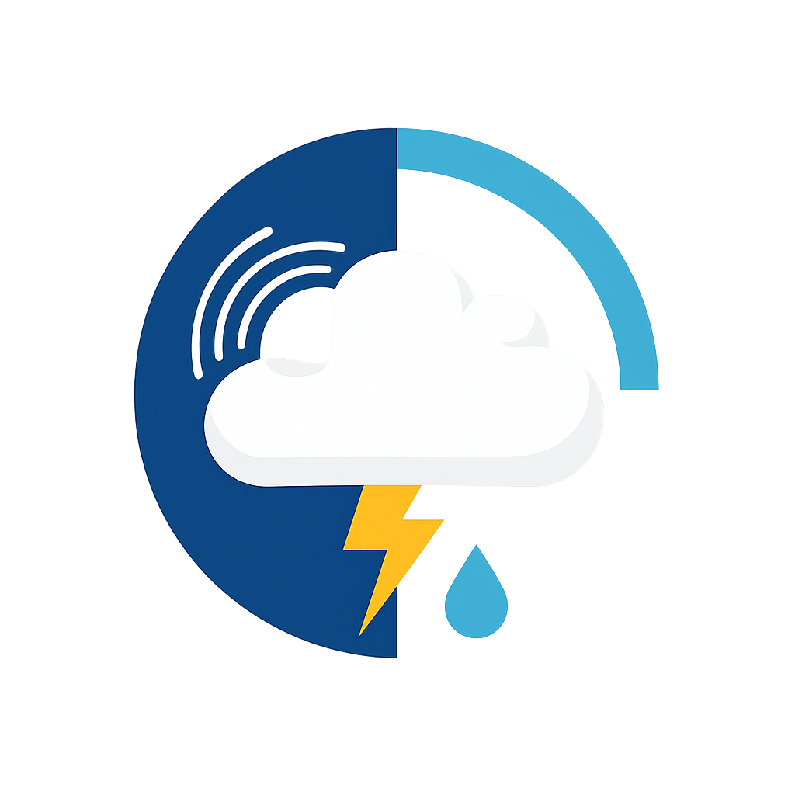
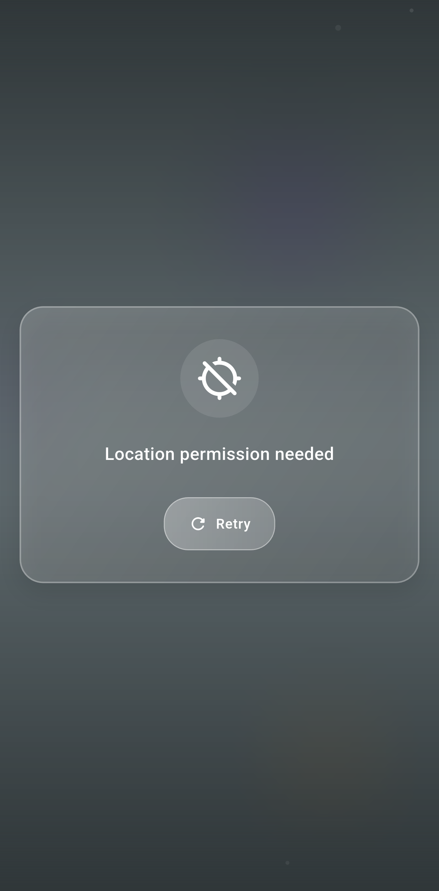
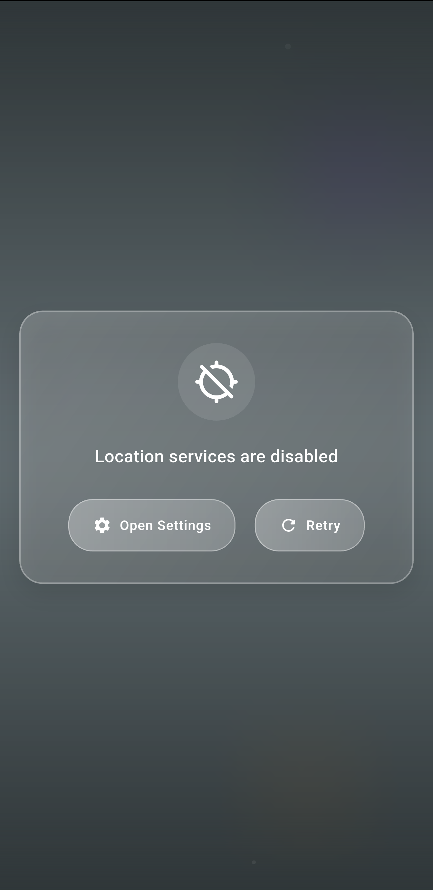
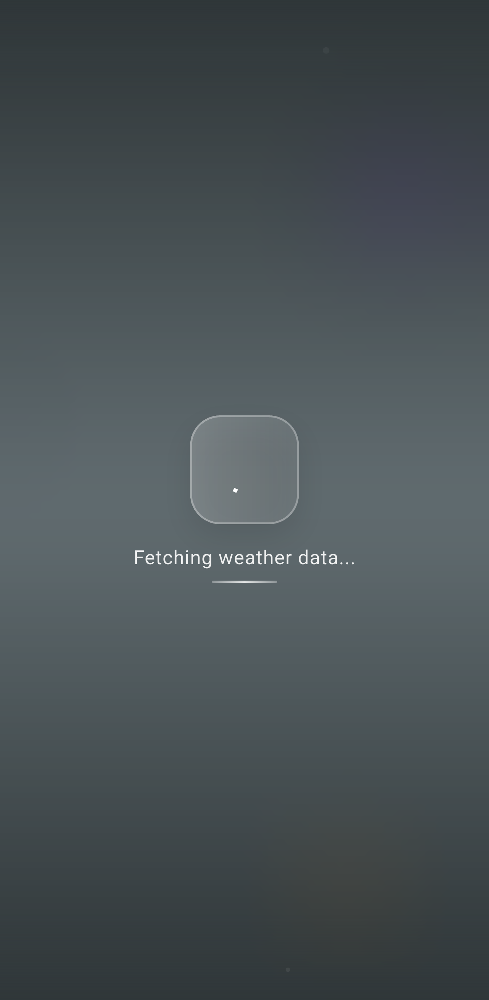
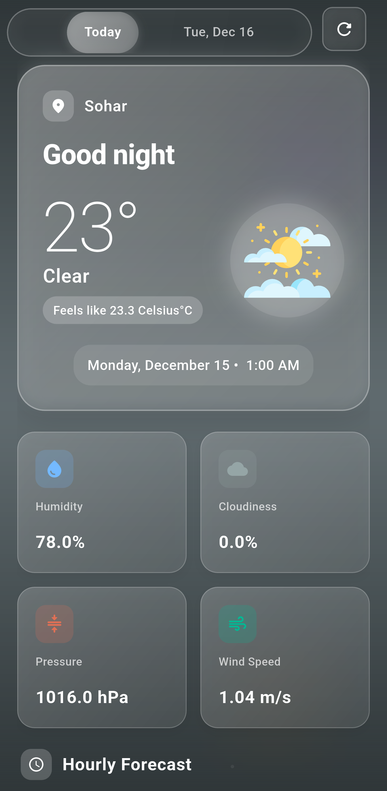
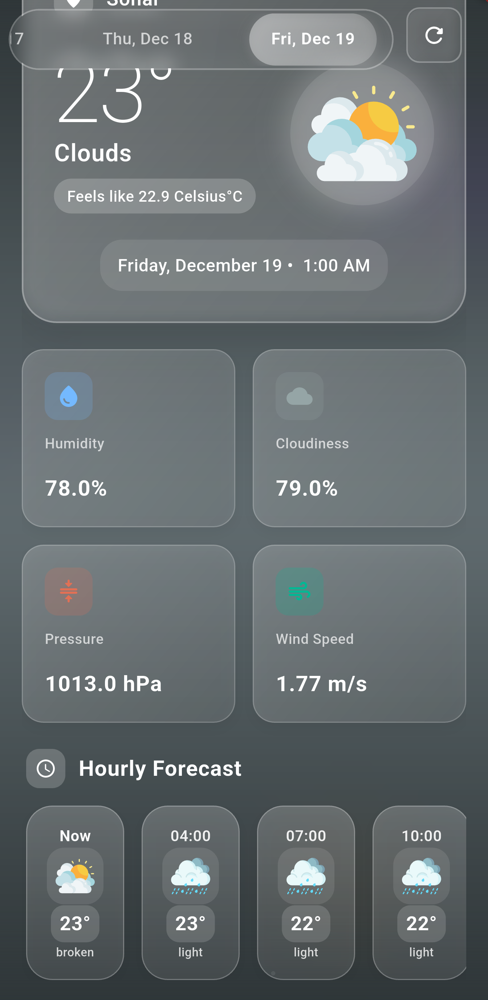

<p align="center">
  
</p>

# Kairos

[](https://github.com/abdulwahed-s/kairos/releases)

Kairos is a modern, feature-rich weather application built with Flutter. It provides accurate 5-day weather forecasts based on your current location, wrapped in a beautiful and animated user interface.

## Features

-   **Real-time Weather Updates**: Fetches the latest weather data using the OpenWeatherMap API.
-   **Location-Based**: Automatically detects your current location to provide relevant weather information.
-   **5-Day Forecast**: View detailed weather forecasts for the next 5 days.
-   **Offline Support**: Gracefully handles offline states with informative error messages.
-   **Animated UI**: Features dynamic backgrounds and smooth transitions for an immersive user experience.
-   **Permission Handling**: Robust handling of location permissions and service status.

## Screenshots

<div align="center">
  
  
  
  
  
</div>

## Tech Stack

-   **Flutter**: UI toolkit for building natively compiled applications.
-   **Bloc/Cubit**: State management for predictable and testable code.
-   **Weather Package**: For fetching weather data.
-   **Geolocator**: For accessing device location.
-   **Intl**: For date and time formatting.
-   **Connectivity Plus**: For monitoring network status.

## Getting Started

### Prerequisites

-   Flutter SDK (3.8.1 or higher)
-   Dart SDK

### Installation

1.  **Clone the repository:**

    ```bash
    git clone https://github.com/abdulwahed-s/kairos.git
    cd kairos
    ```

2.  **Install dependencies:**

    ```bash
    flutter pub get
    ```

3.  **Run the app:**

    ```bash
    flutter run
    ```

## Project Structure

```
lib/
├── core/
│   ├── connection/       # Network connectivity logic
│   ├── functions/        # Helper functions
│   └── model/            # Data models
├── cubit/                # State management (WeatherCubit)
├── presentation/
│   ├── screens/          # Application screens (WeatherScreen)
│   └── widgets/          # Reusable UI components
└── main.dart             # Application entry point
```

## Contributing

Contributions are welcome! Please feel free to submit a Pull Request.
